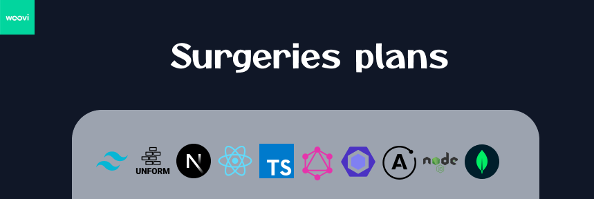
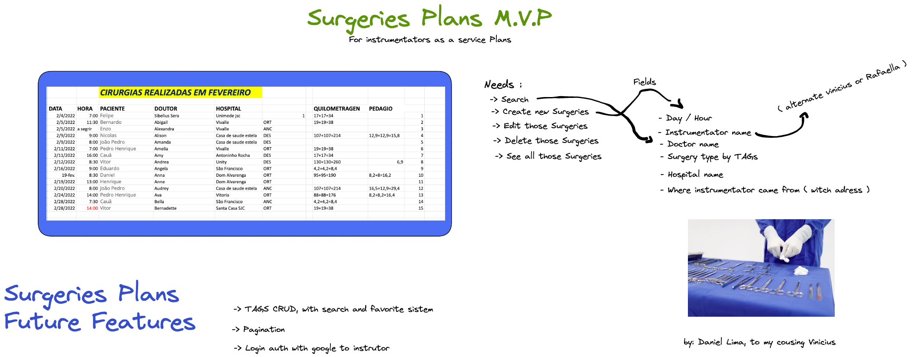
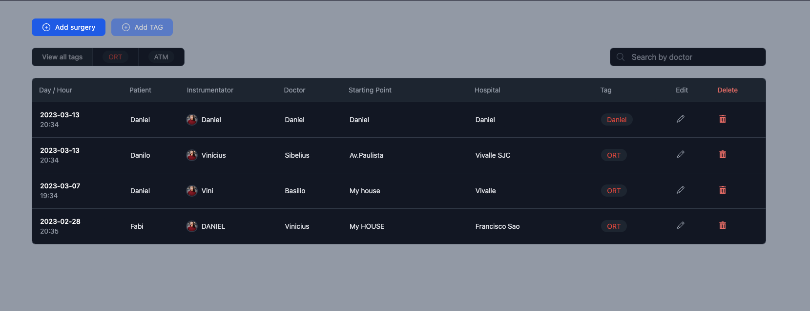
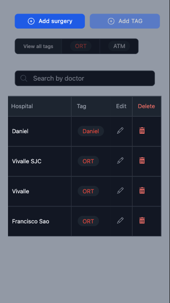

<h1 align="center">
    
</h1>

<p align="center">
 <a href="#-sobre-o-projeto">About the Project</a> •
 <a href="#-funcionalidades">Functionalities</a> •
 <a href="#-layout">Layout</a> • 
 <a href="#-como-executar-o-projeto">How to Run</a> • 
 <a href="#-tecnologias">Stacks and Techs</a> • 
 <a href="#-autor">Autor</a> • 
</p>

## 💻 About the Project

<p align="center">
    
</p>

<p>This project is made to all instrumentators and doctors who want plans their surgeries . And I dedicate it for my cousing Vinícius, who else work as a Instrumentator, and I give him the idea to make his job as a service and made this project to help him to never lost a excel plans again 😄 .</p>
<p>In the future I will integrate this project with Google Maps API, to users who want calculate how much they expends traveling into surgeries, hospitals and home. And give a overall datas with graphics page .</p>

<p>But, for now, it is a simple and well done CRUD, just to avoid excel and to improve the UX .</p>

---

## ⚙️ Functionalities

- [x] Create Surgery
- [x] Edit Surgery
- [x] Delete Surgery
- [x] Search by Doctor

---

## 🎨 Layout

### Web

<p align="center" style="display: flex; align-items: flex-start; justify-content: center;">
  
  
</p>

### Mobile

<p align="center" style="display: flex; align-items: flex-start; justify-content: center;">
  
  
</p>

---

## 🚀 How to run

### 🧶 Prerequisites

[Git](https://git-scm.com), [Node.js](https://nodejs.org/en/), [Yarn](https://yarnpkg.com/)

#### 🎲 Run the Backend (server)

### `FOLLOW THE .ENV.EXAMPLE AND CREATE A .ENV.LOCAL with mongodb key`

```bash

# Clone this repo
$ git clone https://github.com/bolodissenoura/GQL-study-project

# go-to backend folder
$ cd backend

# Install dependencies
$ yarn install

# Run in dev mode
$ yarn run dev

# The server will run at localhost:4000

```

#### 🧭 Running the Frontend web

```bash

# Clone this repo
$ git clone https://github.com/bolodissenoura/GQL-study-project

# go-to backend folder
$ cd frontend

# Install dependencies
$ yarn install

# Run in dev mode
$ yarn run dev

# The server will run at localhost:3000

```

---

## 🛠 Stacks and Techs


#### **Website** ([Next.js](https://nextjs.org/))

- **[react-modal](https://www.npmjs.com/package/react-modal)**
- **[Tailwind](https://tailwindcss.com/)**
- **[Unform](https://github.com/unform/unform)**

#### [](https://github.com/tgmarinho/Ecoleta#server-nodejs--typescript)**Server** ([NodeJS](https://nodejs.org/en/))

- **[Graphql](https://graphql.org/)**
- **[Apollo Server](https://www.apollographql.com/docs/apollo-server/)**
- **[Mongoose](https://mongoosejs.com/)**

#### [](https://github.com/tgmarinho/Ecoleta#utilit%C3%A1rios)

---

## 🦸 Autor

<sub><b>Daniel Lima</b></sub>
<br />
<a href="https://instagram.com/daniellimae" target="_blank"></a>
 	<a href="https://www.twitch.tv/bolodissenouraa" target="_blank"></a>
 <a href="https://discord.gg/pDbY76q8Qf" target="_blank"></a> 
  <a href="https://www.linkedin.com/in/daniel-alves-lima-b53090200/" target="_blank"></a> 


---
